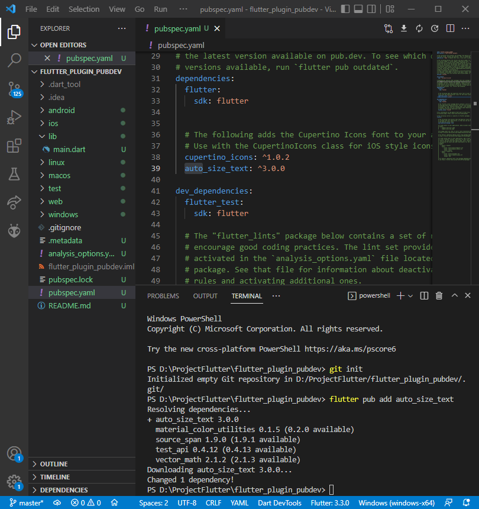

# flutter_plugin_pubdev

## Addina Nurul Mawaddah

## Praktikum Menerapkan Plugin di Project Flutter

#### 1. Selesaikan Praktikum tersebut, lalu dokumentasikan dan push ke repository Anda berupa screenshot hasil pekerjaan beserta penjelasannya di file readme.md!

#### 2. Jelaskan maksud dari langkah 2 pada praktikum tersebut!
 

Penjelasan : 

#### 3. Jelaskan maksud dari langkah 5 pada praktikum tersebut!
Penjelasan : pada kode diatas terdapat error karena package autosizetext tersebut tidak di import ke dalam file tersebut, maka ditambahkan import untuk package atosize diatas sendiri. pada isi text tidak di deklari terlebih dahulu tipe data di dalamnya, maka ditambahkan untuk deklarasi tipe data string dan dijadikan key required

#### 4. Pada langkah 6 terdapat dua widget yang ditambahkan, jelaskan fungsi dan perbedaanya
 
Penjelasan : 
pada kode diatas terdapat error karena package autosizetext tersebut tidak di import ke dalam file tersebut, maka ditambahkan import untuk package atosize diatas sendiri. pada isi text tidak di deklari terlebih dahulu tipe data di dalamnya, maka ditambahkan untuk deklarasi tipe data string dan dijadikan key required

### 5. Jelaskan maksud dari tiap parameter yang ada di dalam plugin auto_size_text berdasarkan tautan pada dokumentasi ini! 
Penjelasan :
Terdapat beberapa parameter seperti : 
1. Parameter maxline yang berfungsi memberi batasan pada line tersebut, apabila parameter tidak ada parameter maxLines yang ditentukan, AutoSizeText hanya cocok dengan teks sesuai dengan lebar dan tinggi yang tersedia.
2. Parameter minFontSize & maxFontSize yang berfungsi untuk mengukur text yang dihasilkan dan mengubah skalanya agar sesuai. minFontSize untuk menentukan ukuran font terkecil. Jika teks masih tidak sesuai, itu akan ditangani secara overflow, minFontSize default adalah 12. maxFontSize menetapkan ukuran font terbesar
3. group untuk menyingkronkan ukuran beberapa font pada AutoSizeTexts. Mereka akan sesuai dengan batasannya dan semua AutoSizeText dalam grup yang sama memiliki ukuran yang sama
4. stepGranularity untuk mencoba ukuran font disesuaikan dengan batasanya. stepGranularity menentukan seberapa besar ukuran font dikurangi setiap langkah. Biasanya, nilai ini tidak boleh di bawah 1 untuk performa terbaik.
5. presetFontSizes untuk mendiskripsika ukuran font tertentu apabila ingin mengaturnya dengan presetFontSizes. Jika presetFontSizes diatur, minFontSize, maxFontSize, dan stepGranularity akan diabaikan.
6. overflowReplacement untuk meluap jika tidak sesuai dengan batasnya, widget ini akan ditampilkan sebagai gantinya. Ini dapat berguna untuk mencegah teks menjadi terlalu kecil untuk dibaca.
7. Rich Text dapat digunakan untuk gaya teks atau tautan yang berbeda dengan AutoSizeText. Cukup gunakan konstruktor AutoSizeText.rich()

